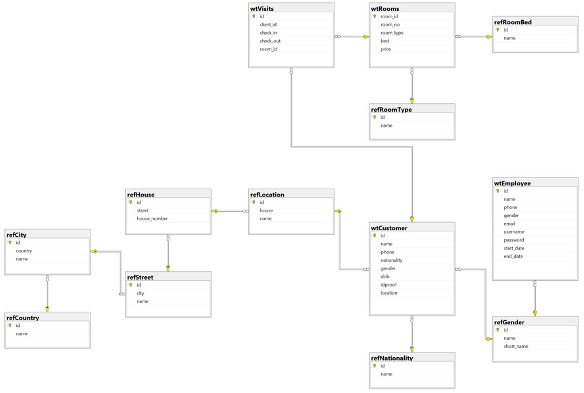
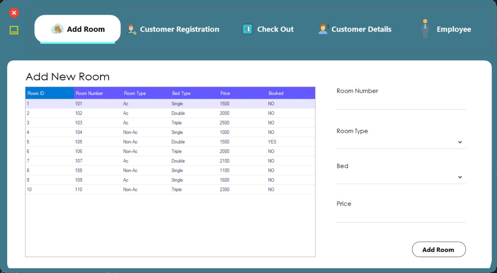
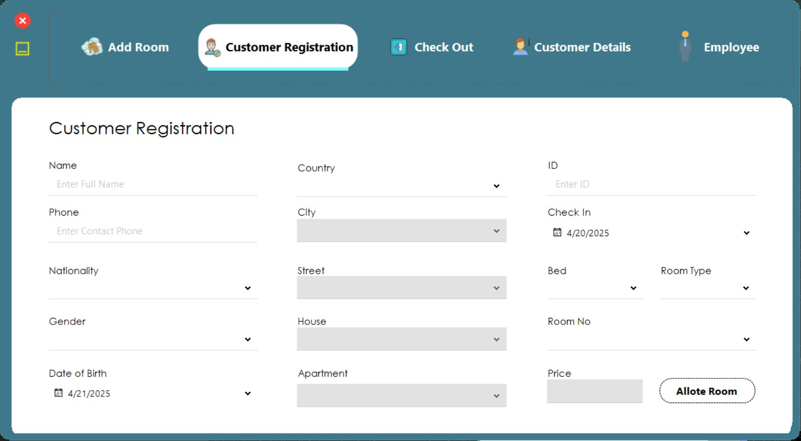
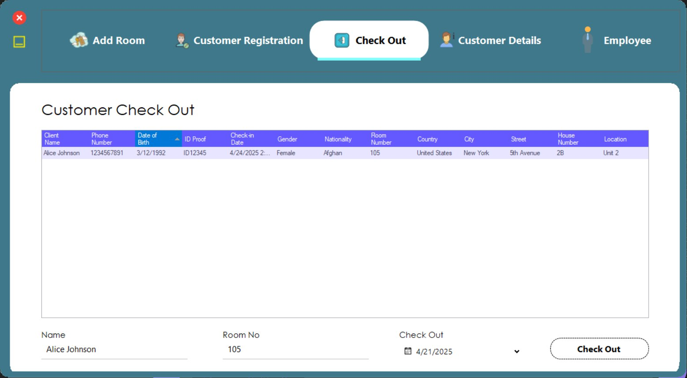
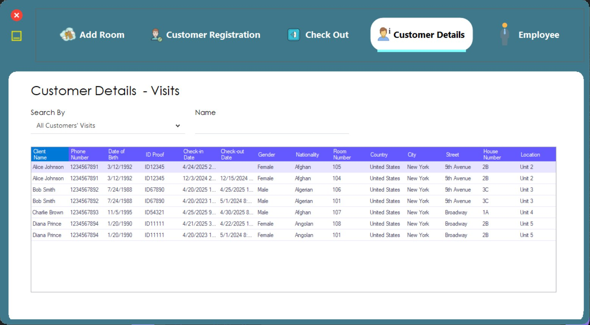
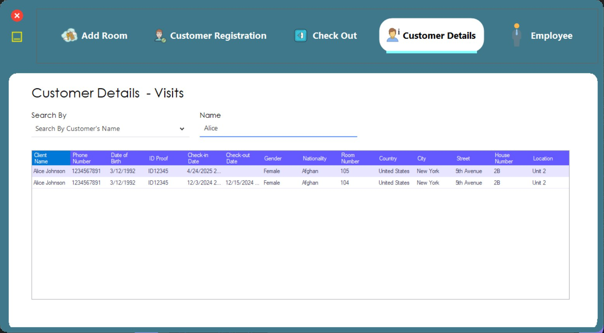
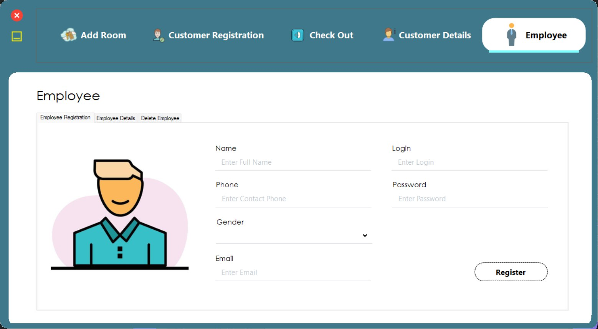
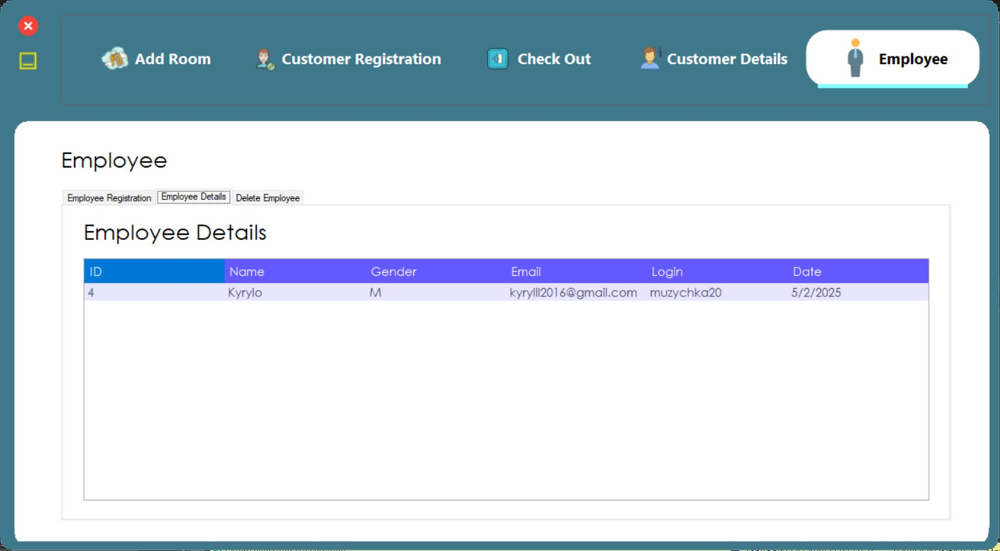
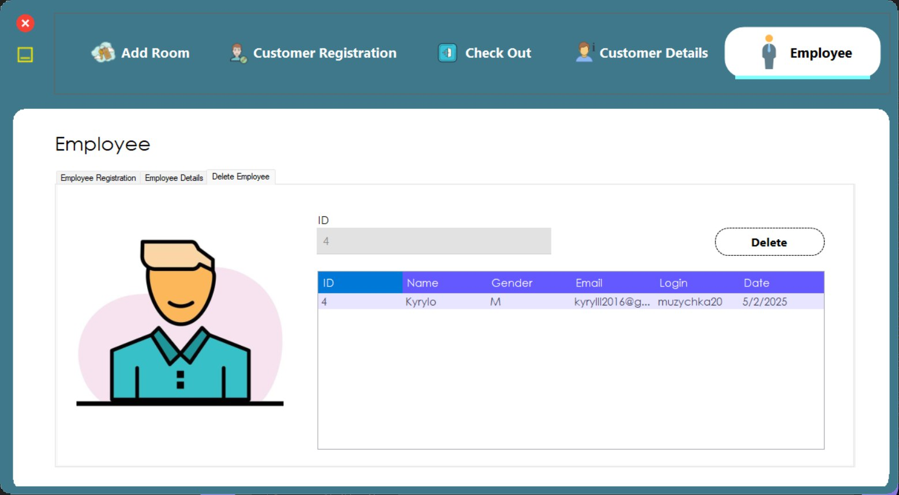

# 🏨 Hotel Management System – C# WinForms + SQL Server

This repository contains a desktop application for managing hotel operations such as room booking, client check-in/check-out, employee records, and reference data like room types, nationalities, and addresses. The system is built using **C# WinForms** as the front-end and **Microsoft SQL Server** as the back-end database.

    

---

## 📁 Structure

The system is organized into multiple database tables, forming a well-structured relational model. It supports:

- **Room management**: `wtRooms`, `refRoomType`, `refRoomBed`
- **Guest management**: `wtCustomer`, `wtVisits`, `refGender`, `refNationallity`, `refLocation`
- **Employee records**: `wtEmployee`
- **Address hierarchy**: `refLocation`, `refHouse`, `refStreet`, `refCity`, `refCountry`

    

---

## 🗃 Database Design

The database is designed with normalized tables to ensure data integrity and efficient relationships between entities.

### 🔑 Key Entities & Relationships

#### One-to-Many (1:Many) relationships:

- `refRoomType` → `wtRooms`
- `refRoomBed` → `wtRooms`
- `wtCustomer` → `wtVisits`
- `wtRooms` → `wtVisits`
- `refGender`, `refNationallity`, `refLocation` → `wtCustomer`
- `refLocation` → `refHouse`
- `refHouse` → `refStreet`
- `refStreet` → `refCity`
- `refCity` → `refCountry`

    
    

## 💻 Application Features

- View and manage hotel rooms, assign types and beds.
- Register guests with personal information and identity details.
- Track check-in and check-out of visitors.
- Maintain employee records and their employment periods.
- Use reference tables for clean data (dropdowns for gender, countries, room types, etc.).
- Store and resolve address information hierarchically:
  - `Country → City → Street → House → Location`.

    
    

## 🔧 Technologies Used

- **C# WinForms** – UI Layer for interaction with hotel data.
- **SQL Server** – Relational database management system.
- **Stored Procedures / Views** – For complex queries and modular logic.
- **Entity-Relationship Diagram (ERD)** – Models the logical database structure and relationships.

    
    

## 📌 Notes

This system can serve as a complete learning resource or a starting point for building production-ready hotel management software with a clear separation between data, logic, and presentation layers.

    
    

